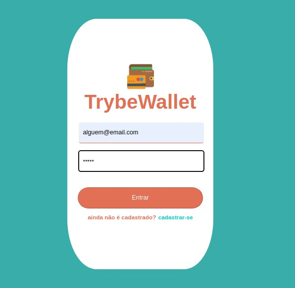
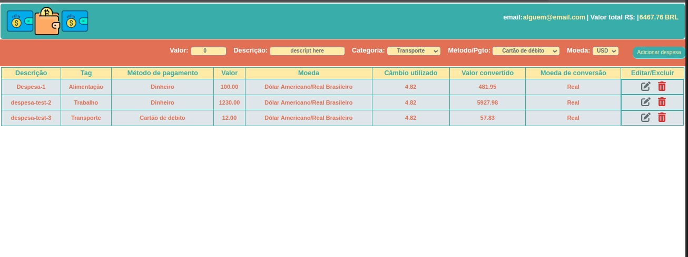

## TrybeWallet :dollar: :gear:

<details>
  <summary><strong>O que foi desenvolvido</strong></summary><br />

  Neste projeto eu pude desenvolver uma carteira de controle de gastos com conversor de moedas, onde ao utilizar essa aplicação um usuário deverá ser capaz de:

  - Adicionar, remover e editar um gasto;
  - Visualizar uma tabelas com seus gastos;
  - Visualizar o total de gastos convertidos para uma moeda de escolha;
</details>

<details>
  <summary><strong> Skills :</strong></summary><br />

Neste projeto, validei skills como:

- Criar um _store_ Redux em aplicações React

- Criar _reducers_ no Redux em aplicações React

- Criar _actions_ no Redux em aplicações React

- Criar _dispatchers_ no Redux em aplicações React

- Conectar Redux aos componentes React

- Criar _actions_ assíncronas na sua aplicação React que faz uso de Redux.
</details>




### :gear: Instalação

1 - Clone o repositório:

```
git clone git@github.com:DeoliveiraJR/Trybe-trybewallet.git
```

2 - Acesse o projeto e Instale as dependências :

```
cd Trybe-trybewallet
npm install
```

3 - inicialize a aplicação:

```
npm start
```

agora voce poderá acessar no seu browser pelo locahost: http://localhost:3000/


### 🛠️ Tecnologias:

* HTML5
* CSS3(Class method)
* JavaScript ES6+
* React.js(Class Metod)
* LottieFiles
* React Icons (icon library)
* Redux
* Redux tunk

Neste projeto utilizamos da API [AwesomeAPI](https://docs.awesomeapi.com.br/api-de-moedas) para consumir dados de moedas.
